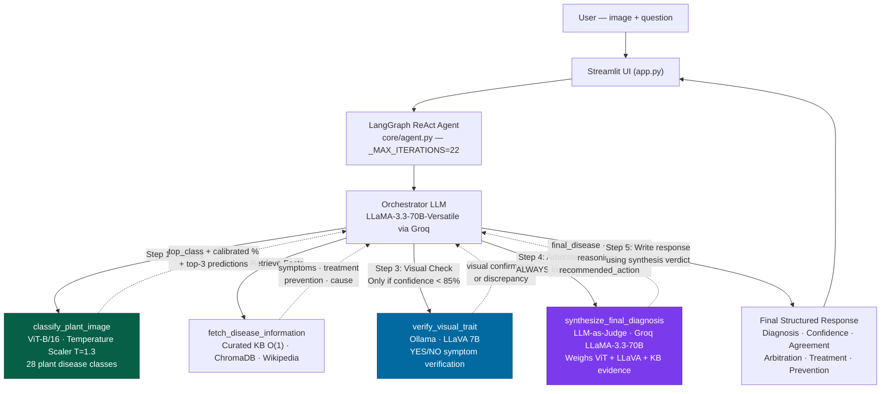

# 🌿 MAVRIS: Advanced Plant Disease Agent
*(2026 AAAI-Grade Research Architecture)*

A **System 2, Multi-modal Test-Time Compute Agent** that diagnoses plant diseases from leaf photographs. It utilizes a trained ViT backbone for primary classification, a Curated Vector Knowledge Base for RAG, an active **Visual Verification Loop** via LLaVA, and a final **LLM Arbitrator** that weighs all evidence to produce a single authoritative verdict.

## 🔬 Key 2026 Autonomous Research Features

1. **System 2 Visual Verification:** The agent doesn't blindly trust early predictions. If confidence is below 85%, it asks the local VLM (LLaVA) targeted questions (e.g., "Do you see concentric rings?") to physically verify the symptoms before responding.
2. **Self-Correction Protocol:** If the VLM denies the primary symptom, the agent adapts—scaling its visual search to broad damage to compensate for low-res imagery instead of prematurely failing.
3. **LLM Arbitrator (New):** After ViT classification, KB retrieval, and LLaVA verification, a dedicated **LLM-as-Judge** call synthesizes all three evidence sources into one final authoritative verdict — resolving conflicts and flagging true discrepancies.
4. **Calibrated Epistemic Uncertainty:** The ViT softmax logic is explicitly calibrated via **Temperature Scaling** (T=1.3). Confidence percentages are statistically rigorous mathematically.
5. **Hierarchical Knowledge Retrieval:** 28 expert-crafted disease profiles in an $O(1)$ dictionary loop, backed by a semantic **ChromaDB** index, preventing Wikipedia-induced RAG wipeouts.

---

## 🏗️ Architecture



## 🔄 Full Pipeline Walkthrough

**When the user uploads an image, the agent always runs these steps:**

1. **Classify** — ViT-B/16 predicts the disease class + calibrated confidence %.
2. **Retrieve** — Knowledge Base fetches structured symptoms, treatment, and cause.
3. **Verify** *(if confidence < 85%)* — LLaVA is asked a targeted YES/NO question about a key visual symptom. If it says NO, a broader fallback question is asked.
4. **Arbitrate (New)** — `synthesize_final_diagnosis` sends all three evidence blocks to a Groq LLM. It weighs them and returns:
   - `AGREEMENT` — ViT and LLaVA agree → high-confidence verdict.
   - `CONFLICT_RESOLVED` — they disagreed but the LLM resolved it with reasoning.
   - `UNRESOLVABLE` — genuine conflict; user is asked for a clearer photo.
5. **Respond** — The agent writes the final output using the arbitration verdict as ground truth.

## 📊 Confidence Routing Rules

| Calibrated Confidence | Step 3 — Visual Check | Step 4 — Arbitration |
|---|---|---|
| **≥ 85%** | Skipped — LLaVA not called | ✅ Always runs · `visual_verification = NOT_PERFORMED` |
| **40% – 84%** | ✅ LLaVA verifies 1 key symptom | ✅ Always runs · uses LLaVA output |
| **< 40%** | ✅ LLaVA runs on TOP-2 guesses | ✅ Always runs · may return `UNRESOLVABLE` |

---

## 📂 Project Structure

```
MAVRIS/
  app.py                 — Streamlit Visual Interface
  requirements.txt       — Dependencies (langgraph, chromadb, etc.)
  plant_model.pth        — Trained ViT weights
  .chromadb_knowledge/   — Cached semantic vector index (built on first run)
  core/
    agent.py             — Multi-turn ReAct Graph logic (_MAX_ITERATIONS=22)
    knowledge_base.py    — Curated 28-class agronomic profiles + ChromaDB
    model.py             — ViT Singleton + TemperatureScaler active
    tools.py             — 5 LangChain @tools (ViT · KB · LLaVA · LLM Arbitrator · Q&A)
    prompts.py           — 5-step Test-Time Compute + Arbitration instructions
    retriever.py         — Clean search abstraction layer
```

## 🚀 Setup & Execution

### 1. Requirements
Ensure you have `Ollama` installed on your machine with the `llava` model pulled for the verification loop to work:
```bash
ollama run llava
```

### 2. Environment Variables
Create a `.env` file from the example:
```env
GROQ_API_KEY=gsk_your_actual_key_here
MODEL_PATH=./plant_model.pth
```

### 3. Run the System
Run it using your dedicated PyTorch environment (Hardware Acceleration is automatically handled across ViT and Ollama):

```bash
C:\Users\Nithin\Desktop\pytorch\venv\Scripts\python.exe -m streamlit run app.py
```

Opens locally at `http://localhost:8501`.

## 🧪 Response Format

```text
Diagnosis:   [final_disease from LLM Arbitrator]
Confidence:  [final_confidence] — High / Moderate / Low
Agreement:   [AGREEMENT | CONFLICT_RESOLVED | UNRESOLVABLE]
Arbitration: [1-2 sentence reasoning from the LLM Judge]
Visual Verification: [Confirmed exact symptom / general damage confirmed / NOT_PERFORMED]

Summary: [2-3 sentences from the Knowledge Base]

Symptoms to look for:
- [Symptom 1]
- [Symptom 2]

Recommended treatment:
1. [Actionable step]

Prevention:
- [Best practice]

Immediate action: [recommended_action from LLM Arbitrator]
```
