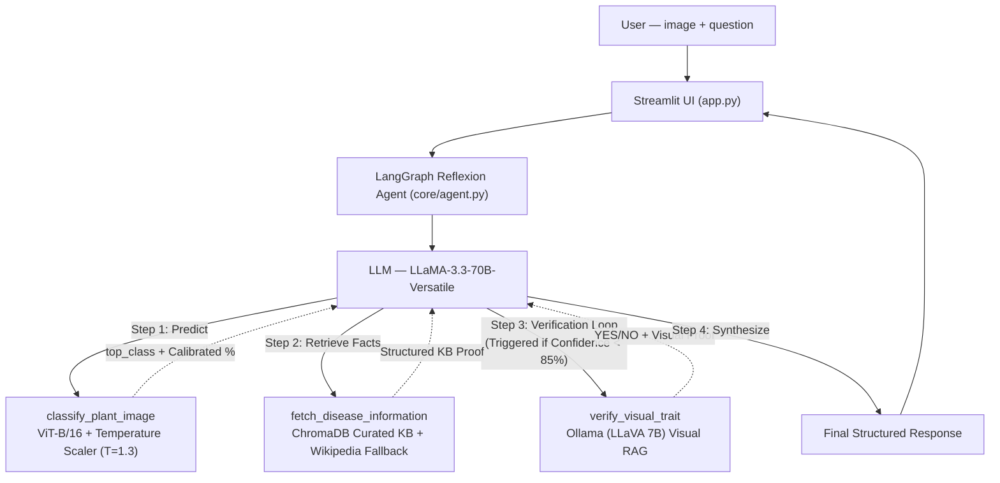

# 🌿 MAVRIS: Advanced Plant Disease Agent
*(2026 AAAI-Grade Research Architecture)*

A **System 2, Multi-modal Test-Time Compute Agent** that diagnoses plant diseases from leaf photographs. It utilizes a trained ViT backbone for primary classification, a Curated Vector Knowledge Base for RAG, and an active **Visual Verification Loop** via a Vision-Language Model (LLaVA) to self-correct and detect hallucinations.

## 🔬 Key 2026 Autonomous Research Features

1. **System 2 Visual Verification:** The agent doesn't blindly trust early predictions. If confidence is below 85%, it asks the local VLM (LLaVA) targeted questions (e.g., "Do you see concentric rings?") to physically verify the symptoms before responding.
2. **Self-Correction Protocol:** If the VLM denies the primary symptom, the agent adapts—scaling its visual search to broad damage to compensate for low-res imagery instead of prematurely failing.
3. **Calibrated Epistemic Uncertainty:** The ViT softmax logic is explicitly calibrated via **Temperature Scaling** (T=1.3). Confidence percentages are statistically rigorous mathematically.
4. **Hierarchical Knowledge Retrieval:** 28 expert-crafted disease profiles in an $O(1)$ dictionary loop, backed by a semantic **ChromaDB** index, preventing Wikipedia-induced RAG wipeouts.

---

## 🏗️ Architecture



## 🔄 The Visual Verification Loop (Test-Time Compute)

**When the user uploads an image:**
1. **Primary Classification:** ViT runs inference -> Scaled Confidence %.
2. **Routing:**
   - **>= 85% Confidence:** Retrieve KB traits, answer directly.
   - **< 85% Confidence (Uncertain):** The agent stops. It retrieves the expected visual symptoms of the disease, and queries the local VLM (LLaVA): *"Do you see [symptom]?"*
3. **Self-Correction:** If LLaVA fails to find the symptom (due to blurriness or incorrect ViT guess), the Agent formulates a broader safety question ("Do you see ANY damage?") to salvage the diagnosis or flags a True Discrepancy.

## 📊 Confidence Routing Rules

| Calibrated Confidence | Agent Behaviour |
|---|---|
| **85% or above** | High confidence. Trust ViT. Full diagnosis, symptoms, and treatment. |
| **40% – 84%** | Moderate. Ambiguous image. **Must trigger Visual Verification Loop (LLaVA)**. |
| **Below 40%** | Low confidence. ViT is stumped. Run Visual Verification on TOP-2 closest guesses to determine true label. |

---

## 📂 Project Structure

```
MAVRIS/
  app.py                 — Streamlit Visual Interface
  requirements.txt       — Dependencies (langgraph, chromadb, etc.)
  plant_model.pth        — Trained ViT weights
  .chromadb_knowledge/   — Cached semantic vector index (built on first run)
  core/
    agent.py             — Multi-turn ReAct Graph logic (_MAX_ITERATIONS=18)
    knowledge_base.py    — Curated 28-class agronomic profiles + ChromaDB
    model.py             — ViT Singleton + TemperatureScaler active
    tools.py             — 4 LangChain @tools (ViT, KB, Search, LLaVA VLM)
    prompts.py           — o3-style Test-Time Compute instructions
    retriever.py         — Clean search abstraction layer
```

## 🚀 Setup & Execution

### 1. Requirements
Ensure you have `Ollama` installed on your machine with the `llava` model pulled for the verification loop to work:
```bash
ollama run llava
```

### 2. Environment Variables
Create a `.env` file from the example:
```env
GROQ_API_KEY=gsk_your_actual_key_here
MODEL_PATH=./plant_model.pth
```

### 3. Run the System
Run it using your dedicated PyTorch environment (Hardware Acceleration is automatically handled across ViT and Ollama):

```bash
C:\Users\Nithin\Desktop\pytorch\venv\Scripts\python.exe -m streamlit run app.py
```

Opens locally at `http://localhost:8501`.

## 🧪 Response Format

```text
Diagnosis: [Disease Name]
Confidence: [Calibrated %] — High / Moderate / Low
Visual Verification: [Confirmed exact symptom / general damage confirmed / True Discrepancy Found] 

Summary: [Knowledge Base Synthesis]

Symptoms to look for:
- [Symptom 1]
- [Symptom 2]

Recommended treatment:
1. [Actionable step]

Prevention:
- [Best practice]
```
