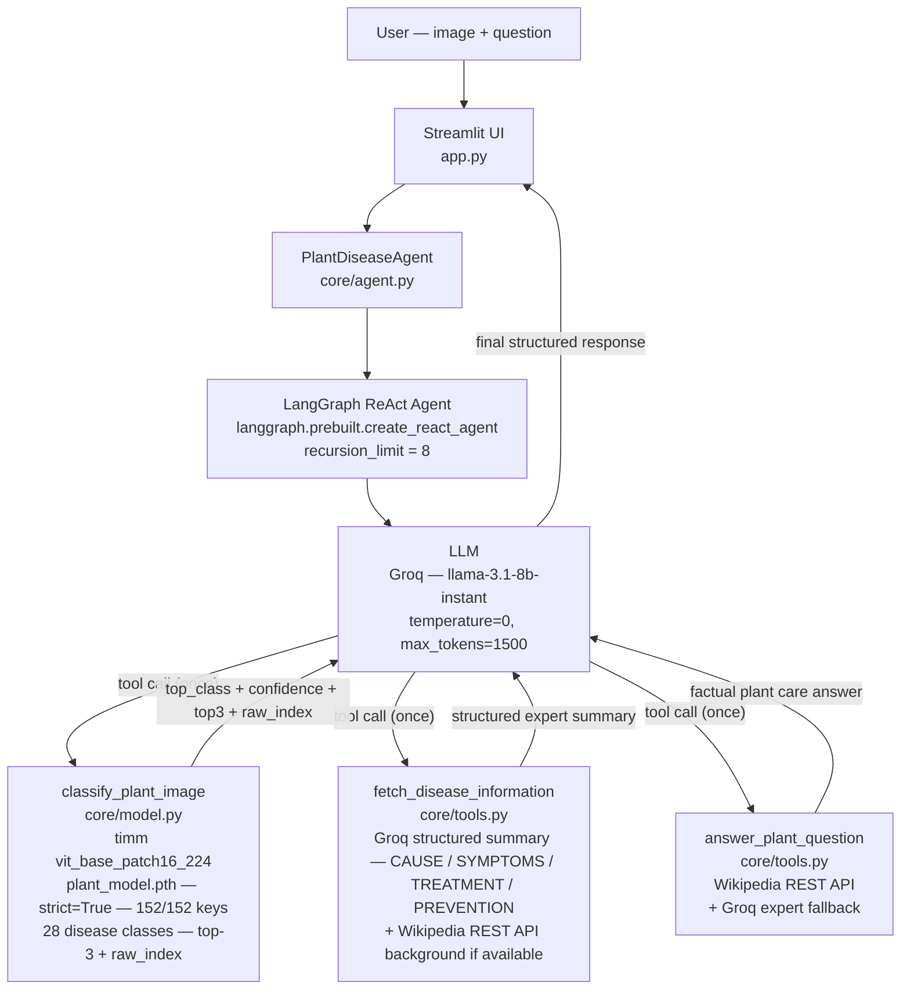

# Plant Disease Diagnosis Agent

A LangGraph ReAct agent that wraps a trained ViT model (`plant_model.pth`) to diagnose plant diseases
from leaf photographs. After classification it retrieves expert disease information and composes
a structured, actionable response.

## Architecture



## Execution flow

**When the user uploads an image (any question):**
1. `classify_plant_image(image_path)` — ViT runs inference, returns top class, confidence %, top-3, raw class index
2. `fetch_disease_information(top_class)` — Groq generates a structured CAUSE/SYMPTOMS/TREATMENT/PREVENTION summary; Wikipedia REST API adds background if available
3. LLM composes the final structured response and stops

**When no image is provided (text question only):**
1. `answer_plant_question(question)` — Wikipedia REST API first; Groq expert fallback if Wikipedia misses
2. LLM composes final response and stops

## Confidence thresholds

| Confidence | Behaviour |
|---|---|
| 70% or above | Full diagnosis, symptoms, treatment, prevention |
| 40 – 69% | Diagnosis with noted uncertainty, full treatment info |
| Below 40% | No disease confirmed. Shows top-3 guesses. Asks for a clearer photo |

## Key design decisions

- **`langgraph.prebuilt.create_react_agent`** — modern tool-calling loop, no fragile string parsing
- **`recursion_limit=8`** — hard cap on agent steps, prevents infinite loops or hangs
- **Singleton classifier** — `plant_model.pth` loads once into GPU/CPU memory at startup, never reloaded
- **`strict=True` weight loading** — all 152 ViT keys verified, zero silent mismatches
- **Dual-source retrieval** — Groq always generates a structured 4-section expert summary; Wikipedia adds scientific background when available. No native DLLs required (pure `requests`)
- **Prompt-enforced ONCE rule** — system prompt explicitly prevents the LLM from calling any tool more than once per turn
- **No disclaimers** — prompt forbids "incomplete response" notes; LLM always composes a complete answer from available data

## Project structure

```
MAVRIS/
  app.py               — Streamlit UI (two-column, session cache, green theme)
  requirements.txt     — Python dependencies
  .env.example         — Environment variable template
  plant_model.pth      — Trained ViT weights (not committed to git)
  core/
    __init__.py
    model.py           — timm vit_base_patch16_224 singleton + 28-class labels
    tools.py           — 3 LangChain @tool functions + Wikipedia/Groq retrieval
    prompts.py         — System prompt (execution order, confidence rules, response format)
    agent.py           — create_react_agent + PlantDiseaseAgent wrapper
```

## Setup

### 1. Install dependencies

Use the existing PyTorch venv or create a new one:

```bash
# Using existing venv
C:\Users\Nithin\Desktop\pytorch\venv\Scripts\python.exe -m pip install -r requirements.txt
```

### 2. Configure environment

```bash
copy .env.example .env
```

Edit `.env`:

```
GROQ_API_KEY=gsk_your_actual_key_here
MODEL_PATH=./plant_model.pth
```

### 3. Run the app

```bash
C:\Users\Nithin\Desktop\pytorch\venv\Scripts\python.exe -m streamlit run app.py
```

Opens at `http://localhost:8501`.

## Usage

1. Upload a clear, well-lit photograph of a plant leaf showing disease symptoms.
2. Type any question — "what is this?", "how do I treat it?", or leave it as-is.
3. Click **Run Diagnosis**.

The agent classifies the image, retrieves expert knowledge, and returns:

```
Diagnosis: [disease name]
Confidence: [%] — High / Moderate / Low

Summary: ...

Symptoms to look for:
- ...

Recommended treatment:
1. ...

Prevention:
- ...
```

## Class labels note

The model has 28 output classes ordered by training folder structure. If a prediction looks wrong,
check the `raw_class_index` in the terminal output and compare against the `PLANT_CLASSES` list
in `core/model.py`. Reorder the list to match your training dataset's `class_to_idx` mapping.
